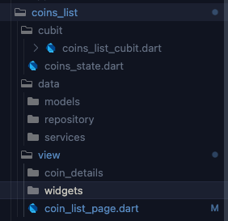
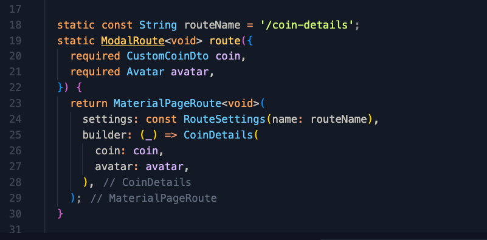
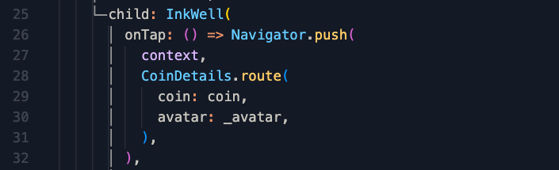

# Coin Aggregator

![coverage][coverage_badge]
[![style: very good analysis][very_good_analysis_badge]][very_good_analysis_link]
[![License: MIT][license_badge]][license_link]

Generated by the [Very Good CLI][very_good_cli_link] 🤖

A Very Good Project created by Very Good CLI.

Hello `Dean` here not really sure why but I feel like I need to justify myself for using this 😅 hahahha

Anyways used very_good_cli to generate very quick and boiler plate project for flutter 🚀

---

## TLDR; 👀 👀

### For the architecture 
This project uses DDD design wherein each a own components is its own island as much as possible 

### Folder Structure 😤

Lets get this straight haha its very messy if everyone just does whatever they want in a project `folder wise`, so with that one way is we as devs can establish a clear cut picture of our folder structure now and build upon it later on~ 


 

### More Details
    - Uploader(feature folder)
        - data
            - bloc (bloc/cubits)
            - models (models whithin coins only)
            - repository
                - coins_repository(`abstract class` serves as a blueprint)
                - coins_repository_impl(`implementation` actual implementation of coins_repository)
            - services (services specific to uploader only)

        if(featureScreen == 1 page)
        - view
            - widgets(widgets within the page)
            - coin_list_page.dart(actual page)

        else (if featureScreen contains one or more screens)
        - view
            - pages
                - page_1
                    - widgets(widgets within the page)
                    - page_1.dart (actual page)
                - page_2
                    - widgets(widgets within the page)
                    - page_2.dart (actual page)
                    
            - uploader_page.dart (main page)

    - lib/core/global_widgets - (global widgets)

    - lib/utils/contants - (constants such as colors, textStyles, any other)
-----------------------------------------------------------------------------

### Routing 🚗
Here's how we route every `feature widget` should have `route()` method


and here's how to use it 




### For the Dependency Injection
getIt


### For the api services opted to use 
Retrofit+Dio combo 💡

### State management - 
Cubits/Bloc 🧊

### Want to run the build_runner? call this script 
``sh scripts/rebuild.sh``

This script just shortens the 

``flutter pub run build_runner build --delete-conflicting-outputs``

and if you want to add upon it feel free to do so, maybe you can flutter clean, pub get, etc..

### Want to see code coverage? call this script 
``sh scripts/gen_lcov.sh``

This script just shortens the

```
flutter test --coverage --test-randomize-ordering-seed random
genhtml coverage/lcov.info -o coverage/
open coverage/index.html
```


### ahhh wait before you get started coding kindly run this script 🙏
``sh scripts/init_hooks.sh``

Why you ask? 👀 
Have you ever encountered this? 
- You're finished with your coding
- naturally you're excited to push your code 
- then after pushing it you then noticed that it had some linter issues 😤 ughhh I know right 
- then you make another commit just to fix the issues

But with this it prevents you to push code's with `bugs, linter issues, any other issues` 🎉

### Ideas for improvement 
- routing can be further optimized/improved with GO_Router/Auto_route
- unit & widget testing

---

## Getting Started 🚀

Currently used flutter ver: 3.3.0

This project contains 3 flavors:

- development
- staging
- production

To run the desired flavor either use the launch configuration in VSCode/Android Studio or use the following commands:

```sh
# Development
$ flutter run --flavor development --target lib/main_development.dart

# Staging
$ flutter run --flavor staging --target lib/main_staging.dart

# Production
$ flutter run --flavor production --target lib/main_production.dart
```

_\*Xam Coding works on iOS, Android, Web, and Windows._


## Running Build Runner 🛠️
To run and generate via build runner 
``` 
sh scripts/rebuild.sh

```
---

## Running Tests 🧪

To run all unit and widget tests use the following command:

```sh
$ sh gen_lcov.sh
```

---

## Working with Translations 🌐

This project relies on [flutter_localizations][flutter_localizations_link] and follows the [official internationalization guide for Flutter][internationalization_link].

### Adding Strings

1. To add a new localizable string, open the `app_en.arb` file at `lib/l10n/arb/app_en.arb`.

```arb
{
    "@@locale": "en",
    "counterAppBarTitle": "Counter",
    "@counterAppBarTitle": {
        "description": "Text shown in the AppBar of the Counter Page"
    }
}
```

2. Then add a new key/value and description

```arb
{
    "@@locale": "en",
    "counterAppBarTitle": "Counter",
    "@counterAppBarTitle": {
        "description": "Text shown in the AppBar of the Counter Page"
    },
    "helloWorld": "Hello World",
    "@helloWorld": {
        "description": "Hello World Text"
    }
}
```

3. Use the new string

```dart
import 'package:xam_coding/l10n/l10n.dart';

@override
Widget build(BuildContext context) {
  final l10n = context.l10n;
  return Text(l10n.helloWorld);
}
```

### Adding Supported Locales

Update the `CFBundleLocalizations` array in the `Info.plist` at `ios/Runner/Info.plist` to include the new locale.

```xml
    ...

    <key>CFBundleLocalizations</key>
	<array>
		<string>en</string>
		<string>es</string>
	</array>

    ...
```

### Adding Translations

1. For each supported locale, add a new ARB file in `lib/l10n/arb`.

```
├── l10n
│   ├── arb
│   │   ├── app_en.arb
│   │   └── app_es.arb
```

2. Add the translated strings to each `.arb` file:

`app_en.arb`

```arb
{
    "@@locale": "en",
    "counterAppBarTitle": "Counter",
    "@counterAppBarTitle": {
        "description": "Text shown in the AppBar of the Counter Page"
    }
}
```

`app_es.arb`

```arb
{
    "@@locale": "es",
    "counterAppBarTitle": "Contador",
    "@counterAppBarTitle": {
        "description": "Texto mostrado en la AppBar de la página del contador"
    }
}
```

[coverage_badge]: coverage_badge.svg
[flutter_localizations_link]: https://api.flutter.dev/flutter/flutter_localizations/flutter_localizations-library.html
[internationalization_link]: https://flutter.dev/docs/development/accessibility-and-localization/internationalization
[license_badge]: https://img.shields.io/badge/license-MIT-blue.svg
[license_link]: https://opensource.org/licenses/MIT
[very_good_analysis_badge]: https://img.shields.io/badge/style-very_good_analysis-B22C89.svg
[very_good_analysis_link]: https://pub.dev/packages/very_good_analysis
[very_good_cli_link]: https://github.com/VeryGoodOpenSource/very_good_cli
